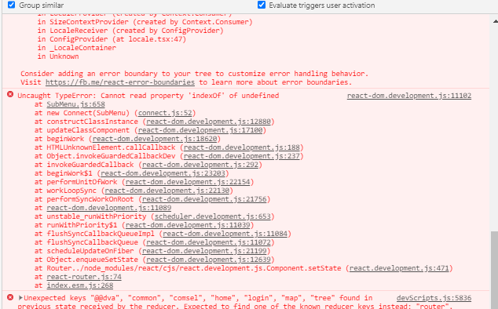

## 更新版本后发生indexOf异常


## 经过检查以前的这段代码需要修改
- 原来的openKeys出错了
```html
      <Menu
        onClick={onClickMenu}
        onOpenChange={onOpenSubMenu}
        openKeys={subMenu}
        selectedKeys={[selPath]}
        mode="inline"
        theme="dark"
      >
```

- 要改成下面这样
```html
      <Menu
        onClick={onClickMenu}
        onOpenChange={onOpenSubMenu}
        openKeys={subMenu || []}
        selectedKeys={[selPath]}
        mode="inline"
        theme="dark"
      >
```